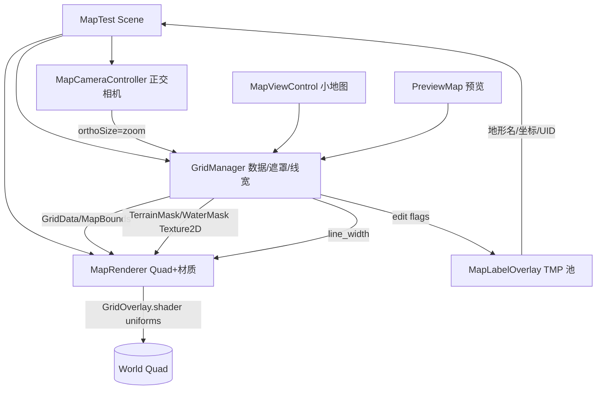

## 用户需求

将 Godot 客户端（`clinetcsharp`）的"地图渲染"子系统循序渐进移植到已创建但为空的团结引擎（tuanjiehub 1.4.4）工程 `unityClientSharp`。本阶段只做地图渲染，不移植网络、实体、战斗与 UI 面板，后续阶段再逐步扩展。

## 产品概述

在团结引擎中用正交相机渲染一张 Godot 风格的策略地图：地形底色、随缩放自适应线宽的抗锯齿网格线、水面波纹动画、地图外与地形墙灰色填充；支持鼠标平移与滚轮缩放；编辑态下叠加地形名/格子坐标/UID 文字标注；并提供小地图与整图迷你预览。

## 核心功能

- 从 `map.json` 加载网格数据（`GridData`）并完成渲染
- 地形颜色填充 + 抗锯齿网格线（线宽随相机缩放自适应）
- 水面波纹动画（fbm 噪声驱动）
- 地图外区域与地形墙（type=9）灰色填充
- 正交相机平移与滚轮缩放
- 编辑态：地形名 / 格子坐标 / UID 文字标注（对象池）
- 小地图 `MapViewControl` 与整图预览 `PreviewMap`

## 技术栈

- 团结引擎 tuanjiehub 1.4.4（基于 Unity 2022 LTS 分支），C# `net8.0`（与原项目一致）
- 渲染：正交 2D 相机 + 覆盖地图世界尺寸的 Quad + ShaderLab/HLSL 自定义材质
- 文字标注：TextMeshPro（世界空间，编辑态按需显示）
- 数据：保留 `System.Text.Json` + `System.IO.File`，替换 Godot `FileAccess`
- 命名空间：`UnityClientSharp`（区别于原 `ClinetCSharp`）

## 实现方案

**策略**：纯逻辑数据层直接复用并去除 Godot API；渲染层用"世界 Quad + 移植后的 ShaderLab 材质"忠实还原 Godot 的网格着色器；文字标注改用 TextMeshPro 对象池；相机用正交相机 + MonoBehaviour 控制器。

**关键决策**

1. **坐标约定**：逻辑/世界坐标沿用 Godot 语义（pos.y 向下、屏幕 Y 向下）。在 Unity 中通过地图 Quad / 材质层统一做 Y 翻转，使屏幕上方向与原 Godot 一致，避免改动所有坐标换算逻辑。`GridToWorld`/`WorldToGrid` 与 Godot 完全等价。
2. **渲染范式**：Godot `Node2D._Draw()` + `ShaderMaterial` → Unity 一个覆盖地图世界尺寸的 Quad + `GridOverlay.shader`；`MapRenderer` 每帧把 `grid_size/line_width/aa_softness/line_color/map_size_world/terrain_mask/water_mask/outside_map_color` 推给材质。地形/水遮罩纹理由 `GridManager` 在 CPU 端从 `GridData` 生成（与原 `UpdateTerrainMask` 逻辑一致），仅在地形变化或加载地图时重建。
3. **线宽自适应**：原 `GridManager._Process` 按 `Camera2D.Zoom` 重算 `line_width`；Unity 中按正交相机 `orthographicSize`（即 zoom）每帧重算并 `SetFloat`。
4. **水面动画**：原 shader 用 `TIME` 驱动 fbm；Unity 用 `_Time.y`。
5. **文字标注**：原 `_Draw` 用 `DrawString`；Unity 用 TextMeshPro 世界空间对象池，仅在编辑态且 zoom 超过阈值时生成/回收。

**性能**

- 遮罩纹理仅在 `NotifyTerrainChanged`/`LoadMap` 时重建，尺寸=MapBounds（几十~几百像素），开销低且与格子数无关。
- 网格线为单次 GPU 绘制（一个 Quad），O(1)，与格子数量无关。
- 文字标注仅在编辑态按需绘制，使用对象池避免 GC。
- 复用同一 `Texture2D` 实例（与原 `ImageTexture` 复用一致），避免纹理重建导致的批次/缓存问题。
- 每帧热路径不打印日志；地形重建仅在加载时 `Debug.Log` 一次。

## 实现注意事项

- **复用既有数据格式**：`map.json`、`terrain_config.json` 原样拷贝到 `Assets/StreamingAssets/Data`，不改动 schema。
- **去 Godot API 映射**：`RefCounted`→普通 class；`Godot.Collections.Dictionary/Array`→`System.Collections.Generic`；`GD.Print`→`Debug.Log`；`FileAccess`→`System.IO.File`；`ThemeDB` 字体→TMP 默认/系统字体。
- **循序渐进、最小可运行优先**：先让"落叶乡"加载并渲染出网格线，再逐步加水纹/标注/小地图/预览。
- **Y 翻转集中处理**：只在 `GridOverlay.shader` 或 Quad 的 `scale.y = -1` 处统一翻转，不要散落到坐标换算。
- **视觉对齐基准**：以 Godot 当前"落叶乡"渲染截图作为对比基准，验证网格、地形色、水纹、外灰一致。
- **版本控制**：按 AGENTS.md 铁律，完成实现后未经用户明确指令不提交/推送。

## 架构设计



## 目录结构

```
unityClientSharp/
├── Assets/
│   ├── Scripts/
│   │   └── Map/
│   │       ├── Core/
│   │       │   ├── GridCell.cs           # [NEW] 格子数据；去除 RefCounted/Godot.Collections，标准 Dictionary 序列化
│   │       │   ├── GridData.cs           # [NEW] GridData 容器 + MapBounds 计算（原 GridManager 数据部分）
│   │       │   ├── TerrainConfigUtil.cs  # [NEW] 地形配置加载；System.IO 替换 FileAccess，加载 terrain_config.json
│   │       │   ├── MapDataManager.cs     # [NEW] map.json 读写；System.Text.Json + System.IO，保持原 schema
│   │       │   └── GridMath.cs           # [NEW] GridToWorld/WorldToGrid 纯数学（原 UiUtils，含 Y 翻转约定）
│   │       ├── Rendering/
│   │       │   ├── GridManager.cs        # [NEW] MonoBehaviour 控制器：持有 GridData/MapBounds，生成遮罩纹理，线宽自适应，编辑态标记
│   │       │   ├── MapRenderer.cs         # [NEW] 世界 Quad + 材质；每帧推送 shader uniform（来自 GridManager 与相机）
│   │       │   ├── MapLabelOverlay.cs     # [NEW] 编辑态文字标注 TMP 对象池（地形名/坐标/UID）
│   │       │   ├── MapViewControl.cs      # [NEW] 小地图：地形缩略图 Texture2D + 实体标记
│   │       │   └── PreviewMap.cs          # [NEW] 整图迷你预览（居中型）
│   │       └── Camera/
│   │           └── MapCameraController.cs # [NEW] 正交相机平移/滚轮缩放，驱动线宽重算
│   ├── Shaders/
│   │   └── GridOverlay.shader            # [NEW] ShaderLab/HLSL 移植（网格线/地形填充/水面 fbm/外灰，含 Y 翻转）
│   ├── Data/
│   │   ├── terrain_config.json           # [NEW] 拷贝自 clinetcsharp/data/terrain_config.json
│   │   └── maps/落叶乡/map.json           # [NEW] 拷贝自 clinetcsharp 地图数据
│   └── Scenes/
│       └── MapTest.unity                 # [NEW] 测试场景：正交相机 + Quad + 各管理器挂载
```

## 关键代码结构

```
// GridOverlay.shader 关键 uniform（MapRenderer 每帧 Set，须与 Godot 原 uniform 一一对应）
Properties {
    _GridSize        ("Grid Size",        Float) = 111
    _LineWidth       ("Line Width",       Float) = 1.5
    _AaSoftness      ("AA Softness",      Float) = 1.0
    _LineColor       ("Line Color",       Color) = (1,1,1,1)
    _MapSizeWorld    ("Map Size World",   Vector)= (7100,7100,0,0)
    _TerrainMask     ("Terrain Mask",     2D)   = "white" {}
    _TerrainMaskSize ("Terrain Mask Size",Vector)= (1,1,0,0)
    _WaterMask       ("Water Mask",       2D)   = "black" {}
    _WaterMaskSize   ("Water Mask Size",  Vector)= (1,1,0,0)
    _OutsideMapColor ("Outside Map Color",Color) = (0.15,0.15,0.15,1)
}
```

```
// GridManager 公开面（Unity 等价类型，移植自 Godot 版，仅保留渲染所需）
public class GridManager : MonoBehaviour
{
    public Dictionary<Vector2Int, GridCell> GridData;
    public RectInt MapBounds;
    public int GridSize;
    public bool IsEditMode;
    public void LoadMap(string mapName);
    public void NotifyTerrainChanged();
    public (float lineWidthWorld, Color lineColor) ComputeGridLineRenderStyle(float zoom);
    public Vector2 GridToWorld(Vector2Int g);
    public Vector2Int WorldToGrid(Vector2 w);
    public Texture2D TerrainMask { get; }   // 由 UpdateTerrainMask 生成
    public Texture2D WaterMask   { get; }
}
```