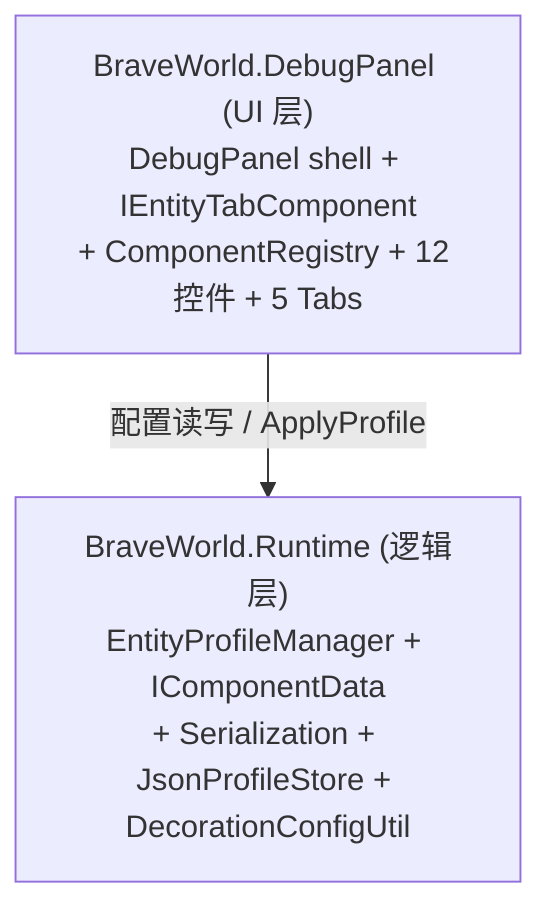

## 产品概述

将 Godot 客户端调试面板（`clinetcsharp/Scripts/DebugPanel*`，5 个 Tab：MapTab / EntityTab / SystemTab / UITab / DecorationTab）等价迁移到 Unity 端（Tuanjie 团结引擎），以运行时 UGUI 浮窗形式提供调试能力。设计文档：`docs/design/debug-panel-unity-migration.md`（已确认选型：asmdef 模块 + 运行时 UGUI；JSON + Newtonsoft.Json 持久化）。

## 核心功能

- 5 个调试 Tab 的等价 UI 与逻辑：地图网格/相机校准、实体 Profile 配置编辑、系统参数、UI 调试、建筑工坊。
- 实体 Profile 配置（组件增删/启停/参数微调）持久化到 `entity_profiles.json`，运行时与配置编辑共享同一份。
- 组件注册表（ComponentRegistry）+ 全部 12 类组件的数据（IComponentData）与序列化闭环，使所有组件可被配置、落盘、回读。
- 即使某配置在 Unity 端暂无消费者（如 InventoryUI / FunctionButtonBar / MapEditor 联动），仍写出配置编辑 UI 并持久化，加 TODO 注明。

## 本次确认的 5 项决策（指导范围）

1. **ComponentRegistry 直接做**：不再推迟，随迁移一并提供（注册表 + 5 个缺失组件类 + 序列化 case 一并补齐，等效 Path A 的注册表层）。
2. **配置编辑解耦**：DebugPanel 偏配置编辑，与其他模块解耦；无消费者也写出配置 UI + 持久化 + TODO。
3. **中文 TMP SDF 字体**：用现有 `NotoSansSC-VF.ttf` 生成中文 SDF 资源，避免中文方块。
4. **InventoryUI / FunctionButtonBar**：Unity 端确认不存在，按决策 2 写出配置 UI + TODO。
5. **asmdef 隔离**：当前只新增 `BraveWorld.DebugPanel.asmdef`（运行时 UI 层）；严格三层隔离（抽干净逻辑层 asmdef）留待二期 Editor 阶段，不阻塞当前迁移。

## 技术栈

- 引擎：Unity 团结引擎 Tuanjie（2022.3.62t8，非标准 Unity；场景 `.scene`、YAML tag `tag:yousandi.cn,2023:`、.meta guid 为 base64）。
- 语言/UI：C# + UGUI（运行时浮窗）；脚本默认不开启 nullable。
- 序列化：Newtonsoft.Json 13.0.3（已 vendoring 到 `Assets/Plugins/NewtonsoftJson/`，引擎缺 System.Text.Json）。
- 工程组织：asmdef 程序集模块（`BraveWorld.Runtime` 已存在；新增 `BraveWorld.DebugPanel`）。
- 编译校验：`check_compile_errors.ps1`（Tuanjie 无头编译；注意 8.3 短路径日志、先杀残留 Tuanjie 进程等坑）。

## 实现策略

- **分层（当前）**：仅两层。`BraveWorld.Runtime`（逻辑层：EntityProfileManager / IComponentData / Serialization / JsonProfileStore / DecorationConfigUtil）与 `BraveWorld.DebugPanel`（UI 层：shell + IEntityTabComponent + ComponentRegistry + 12 控件 + 5 Tab）。UI 层引用逻辑层；严格三层隔离（独立干净逻辑层 asmdef）延后。
- **ComponentRegistry 归属**：Godot 端 `ComponentRegistry` 注册的是 `IEntityTabComponent`（UGUI 控件工厂），故归属 UI 层（`BraveWorld.DebugPanel.asmdef`），不进逻辑层；其元数据/白名单（`ComponentMeta`/`_typeComponents`）随之一同放 UI 层。逻辑层只需补齐 5 个 `IComponentData` 与序列化 case，即完成数据闭环。
- **实体组件铁律**：新增 `IComponentData` 必须同步在 `EntityProfileManager.Serialization.cs` 的 Write/ReadComponentData 加 case；带 alpha 的颜色组件须连 `color_a` 读写（nameplate 等）。组件名字符串须与 `ComponentRegistry` 注册名一致。
- **DecorationConfigUtil**：纯数据缓存层（从 `EntityProfileManager` 同步 decoration Profile 到 `Configs` 字典并触发 `ProfilesChanged`），仅依赖数据类与静态 `EntityProfileManager`，无 UGUI，可放逻辑层（Runtime），便于 DecorationTab 调用。
- **配置读写语义**：结构性变更（组件增删/启停、Profile 增删）立即 `SaveConfig`；属性微调（拖 slider）`ScheduleSave` 防抖 1s（仓库记忆 28653953）。

## 实现要点（防回归）

- 复用现有 `JsonProfileStore`（`IProfileStore`）与 `EntityProfileManager.LoadConfig/SaveConfig`，不重写存储底座。
- 复用 `DraggablePanel.cs` 作 shell 载体；UI 控件按其范式实现（VerticalLayoutGroup / ScrollRect / Slider.PointerUp 替代 Godot DragEnded）。
- `EntityTab` 是配置编辑器：UI 必须始终代表 Profile 数据，禁止 `OnEntityClicked` 调运行时 `SyncFromEntity` 误存瞬时状态（记忆 79121038）。
- 中文文本统一引用中文 SDF 字体资源，避免方块；TMP 资源生成后接入 DebugPanel 文本样式。
- 缺失消费者（MapEditor 一键按钮、InventoryUI、FunctionButtonBar）写出配置 UI + 持久化 + `// TODO: Unity 端暂无对应消费者` 注释，不阻断编译。

## 架构设计



## 目录结构

```
unityClientSharp/Brave-World/Assets/Scripts/
├── BraveWorld.Runtime.asmdef                 # [EXIST] 逻辑层；已引用 UnityEngine.UI / Unity.TextMeshPro
├── Entity/Profile/
│   ├── EntityProfile.cs                      # [MODIFY] 新增 5 个 IComponentData 类（ActionBarData/NameplateData/LevelBadgeData/MonsterAiData/NpcInteractData），与现有数据类同目录
│   ├── EntityProfileManager.Serialization.cs # [MODIFY] Write/ReadComponentData 替换 TODO，加 5 个 case（nameplate 等带 alpha 颜色连 color_a）
│   ├── DecorationConfigUtil.cs               # [NEW] 移植 Godot DecorationConfigUtil（静态化 EntityProfileManager 调用，保留 ProfilesChanged/Configs/DecorationConfig）
│   └── (JsonProfileStore.cs / EntityProfileManager.*.cs 已存在)
├── BraveWorld.DebugPanel.asmdef              # [NEW] 新增 UI 层 asmdef，references: ["BraveWorld.Runtime"]，autoReferenced=false
└── DebugPanel/
    ├── DebugPanel.cs / .Lifecycle.cs / .TabContainer.cs  # [NEW] shell：DraggablePanel 载体 + Tab 切换 + LoadConfig/SaveConfig/ScheduleSave 接线
    ├── IEntityTabComponent.cs                # [NEW] 移植 UI 控件契约（BuildUI/ConnectSignals/SyncFromData/SyncToData/Dispose）
    ├── ComponentRegistry.cs                  # [NEW] 移植注册表（12 工厂 + ComponentMeta + _typeComponents 白名单 + Create/GetAllComponents/GetComponentsForType/GetComponentMeta）
    ├── Components/                           # [NEW] 12 个 UGUI 组件控件（Appearance/Label/Nameplate/Bar×3/ActionBar/LevelBadge/MonsterAi/NpcInteract/Obstacle/BuildingType/Category）
    └── Tabs/
        ├── DebugPanelMapTab.cs (+ partials)      # [NEW] 网格 overlay/相机校准；map_editor 联动留 TODO
        ├── DebugPanelEntityTab.cs (+ partials)   # [NEW] Profile 编辑 + 组件管理（依赖 ComponentRegistry）
        ├── DebugPanelSystemTab.cs (+ partials)   # [NEW] 系统参数；背包调试子节（InventoryUI 缺失）写配置 + TODO
        ├── DebugPanelUITab.cs (+ partials)       # [NEW] UI 调试；功能按钮栏（FunctionButtonBar 缺失）写配置 + TODO
        └── DebugPanelDecorationTab.cs (+ partials) # [NEW] 建筑工坊；依赖 DecorationConfigUtil + ComponentRegistry；"进入地图编辑器放建筑"按钮（MapEditor 缺失）留 TODO

unityClientSharp/Brave-World/Assets/Resources/Fonts/
└── NotoSansSC SDF.asset                      # [NEW] 由 NotoSansSC-VF.ttf 生成的中文 TMP SDF 字体资源
docs/design/debug-panel-unity-migration.md    # [MODIFY] 据本次决策更新 §10.1（Path B→含注册表）、§7 各 Tab 策略、§9 阶段拆分、§8 风险
```

## 关键代码结构（参考）

- `IEntityTabComponent`（移植自 Godot，UGUI 化）：`void BuildUI(Transform container); void ConnectSignals(Action onChanged); IComponentData SyncToData(); void SyncFromData(IComponentData data); void Dispose();`
- `ComponentRegistry`（UI 层静态类）：`void Register(string name, Func<IEntityTabComponent> factory, string displayName, string category, string icon, Color? accent); IEntityTabComponent Create(string name); IEnumerable<(string,string)> GetComponentsForType(string entityType); ComponentMeta GetComponentMeta(string name);`
- 5 个新增 `IComponentData`（例）：`class NameplateData { public float BgOpacity; public Color BgColor; /* 带 alpha，序列化连 color_a */ }`（字段以 Godot `ComponentData/*.cs` 为准）。