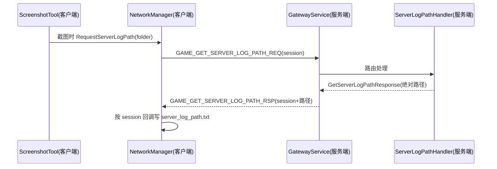

## 用户需求

截屏工具在触发截图时，主动向服务器请求「当前正在写入的服务器日志文件的完全路径」，并将该路径作为文件写入截屏文件夹中，便于后续排查问题时快速定位服务端日志。

## 产品概述

在 `clinetcsharp/Scripts/ScreenshotTool.cs` 的 F12 截屏流程基础上，新增一次客户端→服务器的协议请求：截图瞬间客户端向服务器询问其当前日志文件的绝对路径，服务器返回后客户端把路径字符串保存到本次截屏目录里（仅记录路径，不搬运日志内容）。

## 核心功能

- 协议层新增「请求服务器日志路径」的请求/响应消息（客户端发 REQ，服务器回 RSP）。
- 服务器新增 handler，返回当前正在写入的 Serilog 日志文件绝对路径（按天滚动 `logs/server-YYYYMMDD.log`）。
- 客户端在截屏时发起请求，收到响应后将路径写入截屏文件夹的 `server_log_path.txt`。
- 仅在与服务器已连接时生效；未连接则静默跳过，不影响原有截图与客户端日志保存流程。

## 技术栈与现状

- 客户端：Godot + C#（`clinetcsharp`），网络层 `NetworkManager` 通过 TCP 收发 Protobuf 包。
- 服务端：.NET + C#（`servercsharp`），日志用 Serilog 写文件（`logs/server-.log`，按天滚动）。
- 协议：`protocols/proto/*.proto`，经 `protocols/scripts/build_proto.ts` 生成 C# 到 `clinetcsharp/Scripts/protos`（客户端）与 `servercsharp/src/GameServer.Proto/generated`（服务端）。
- 消息路由：网关 `GatewayService` 自动以 `msgId+1` 回包并回传 `session`（GatewayService.cs:228-230）；handler 经 `[HandlesMessage]` 属性 + 反射自动注册（GameLogicFactory.cs:92-107）。

## 实现方案

采用「请求 + 回调写文件」的 fire-and-forget 模式，避免 Godot 内 `Task` 异步等待的线程上下文问题。

1. **协议新增**：在 `message_id.proto` 增加 `GAME_GET_SERVER_LOG_PATH_REQ = 440` / `GAME_GET_SERVER_LOG_PATH_RSP = 441`（沿用偶数请求、+1 响应的约定）；在 `game.proto` 增加 `GetServerLogPathRequest{}` 与 `GetServerLogPathResponse{ common.ErrorCode code=1; string message=2; string log_path=3; }`。运行 `cd protocols && npm run build` 重新生成双端 C#。
2. **服务端路径来源（单一可信源）**：在 `GameServer.Common` 新增静态类 `ServerLogConfig`，保存日志目录并在请求时按当天日期拼接出绝对路径（`Path.GetFullPath("logs") + "server-" + yyyyMMdd + ".log"`）。放在 `GameServer.Common` 可同时被 host（Program.cs）与 `GameServer.GameLogic`（handler）引用，规避循环依赖；按当天日期计算可兼容跨午夜滚动。
3. **服务端 handler**：新增 `ServerLogPathHandler : IMessageHandler`，`[HandlesMessage(GameGetServerLogPathReq)]`，返回 `GetServerLogPathResponse{ LogPath = ServerLogConfig.GetCurrentLogFilePath() }`。由现有 `RegisterMessageHandlers` 自动扫描注册，无需改注册表。
4. **客户端请求/响应关联**：`NetworkManager` 新增 `_pendingLogPathCallbacks: Dictionary<uint, Action<string>>` 与 `RequestServerLogPath(string folderPath)`。发送前分配 session（`_sessionCounter++`），将「收到路径后写文件」的回调按 session 登记；`SendPacket` 增加可按外部 session 发送的重载。响应到达时 `DispatchMessage` 携带 `packet.Session` 分发到 `HandleServerLogPathResponse`，按 session 取出回调并写入 `server_log_path.txt`。
5. **截屏触发**：`ScreenshotTool.TakeScreenshot` 在保存完 `logs.txt` 后，通过 `GetTree().Root.GetNodeOrNull<NetworkManager>("NetworkManager")` 取得网络管理器并调用 `RequestServerLogPath(folderPath)`。

## 关键时序



## 实现注意

- 复用现有 `SendPacket(MessageId, IMessage)` 与 `_sessionCounter` 机制；仅扩展一个带显式 session 的内部发送重载，保持向后兼容。
- `DispatchMessage` 当前签名不含 session，需将调用点 `DispatchMessage(msgId, data)` 改为 `DispatchMessage(msgId, data, session)` 并同步更新签名（单点调用，影响可控）。
- 未连接服务器时 `RequestServerLogPath` 直接 return，避免异常；回调字典仅在截图时写入，属于低频场景，但应在收到响应或断线时清理，防止极小内存残留。
- 服务器计算路径用 `DateTime.Now` 取当天日期，与 Serilog `RollingInterval.Day` 完全一致，无需读取文件句柄。
- 生成协议后需双端重新编译；服务端改动须按 AGENTS.md 经 `restart.bat` 编译运行验证。

## 目录结构与文件

```
protocols/proto/message_id.proto              # [MODIFY] 新增 440/441 消息ID
protocols/proto/game.proto                    # [MODIFY] 新增 GetServerLogPathRequest/Response 消息体
servercsharp/src/GameServer.Common/ServerLogConfig.cs  # [NEW] 静态共享配置，提供当前日志绝对路径
servercsharp/src/GameServer/Program.cs        # [MODIFY] 初始化日志目录(Set ServerLogConfig.LogDirectory)
servercsharp/src/GameServer.GameLogic/Player/Handlers/ServerLogPathHandler.cs  # [NEW] 处理请求并返回日志路径
clinetcsharp/Scripts/NetworkManager.PacketIO.cs   # [MODIFY] 新增请求方法/回调字典/带session发送重载
clinetcsharp/Scripts/NetworkManager.Dispatch.cs   # [MODIFY] DispatchMessage 增加 session 参数与 RSP 分支
clinetcsharp/Scripts/ScreenshotTool.cs           # [MODIFY] TakeScreenshot 中触发请求
clinetcsharp/docs/截图分析工作流.md              # [MODIFY] 补充说明 server_log_path.txt 来源与用途
```

（生成文件 `clinetcsharp/Scripts/protos/*`、`servercsharp/src/GameServer.Proto/generated/*` 由 build 脚本自动产出，不手动编辑。）

## 关键代码结构

```
// game.proto (C# namespace Game)
message GetServerLogPathRequest {}

message GetServerLogPathResponse {
  common.ErrorCode code = 1;
  string message = 2;
  string log_path = 3;   // 当前正在写入的服务器日志绝对路径
}

// servercsharp/src/GameServer.Common/ServerLogConfig.cs
public static class ServerLogConfig
{
    public static string LogDirectory { get; set; } = "logs";
    public static string GetCurrentLogFilePath()
        => Path.Combine(Path.GetFullPath(LogDirectory), "server-" + DateTime.Now.ToString("yyyyMMdd") + ".log");
}
```

## Agent Extensions

### Skill

- **brainstorming**
- 用途：在动手实现前确认「截屏携带服务器日志路径」的需求边界（连接态处理、文件命名、请求/回调方式、是否搬运日志内容）。
- 预期结果：产出清晰、无歧义的特性范围与约定，避免实现返工。