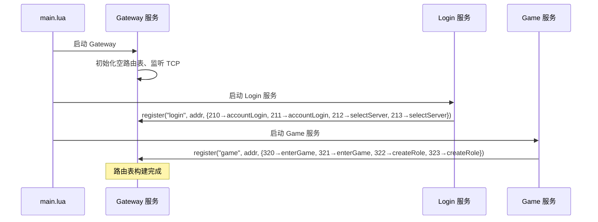
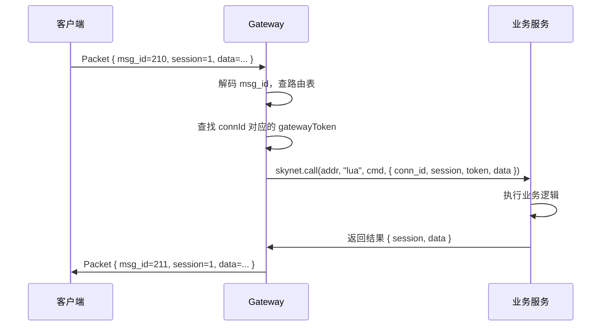

# 服务注册与消息路由机制

## 一、概述

采用**服务自注册**模式：每个业务服务启动时，主动向 Gateway 注册自己处理的消息 ID。Gateway 动态构建路由表，实现消息分发。

**核心原则：**
- 零配置路由，不需要硬编码 msg_id 段划分
- 服务自描述，每个服务声明自己处理哪些消息
- 运行时动态构建，支持热更新

---

## 二、启动流程



**启动顺序保证：**
1. `main.lua` 通过 `skynet.uniqueservice` 同步启动，保证 Gateway 先就绪
2. 后续服务启动后才能注册，不会丢注册

---

## 三、注册协议

### 服务 → Gateway 注册消息

通过 Skynet 内部 Lua 协议发送：

```lua
-- Gateway 收到的注册消息格式
{
    service_name = "login",        -- 服务名（用于调试和日志）
    service_addr = 0x0000000a,     -- skynet 服务地址
    routes = {
        [210] = "accountLogin",    -- msg_id → 命令名
        [211] = "accountLogin",    -- 请求和响应可以映射同一命令
        [212] = "selectServer",
        [213] = "selectServer",
    }
}
```

### Gateway 内部路由表结构

```lua
-- Gateway 维护的路由表
local route_table = {
    -- msg_id → { addr, cmd }
    [210] = { addr = 0x0a, cmd = "accountLogin" },
    [211] = { addr = 0x0a, cmd = "accountLogin" },
    [212] = { addr = 0x0a, cmd = "selectServer" },
    [213] = { addr = 0x0a, cmd = "selectServer" },
    [320] = { addr = 0x0b, cmd = "enterGame" },
    [321] = { addr = 0x0b, cmd = "enterGame" },
    [322] = { addr = 0x0b, cmd = "createRole" },
    [323] = { addr = 0x0b, cmd = "createRole" },
}
```

---

## 四、Gateway 注册服务接口

Gateway 对内暴露以下命令：

| 命令 | 参数 | 说明 |
|------|------|------|
| `register` | `{ service_name, service_addr, routes }` | 注册消息路由 |
| `unregister` | `{ service_addr }` | 注销（服务退出时） |
| `lookup` | `{ msg_id }` | 查询路由（调试用） |

**注册行为：**
- 同一 msg_id 后注册的覆盖先注册的（后启动的服务优先）
- 服务重启后地址变化，重新注册即可覆盖旧地址
- 可选：Gateway 监听服务退出事件，自动清理路由

---

## 五、消息转发流程



**转发时 Gateway 附加的信息：**
```lua
-- Gateway 转发给业务服务的内部消息
{
    conn_id = 1024,         -- 客户端连接ID
    session = 1,            -- 请求会话ID（用于响应匹配）
    token = "eyJhbG...",    -- gatewayToken（从 connId 关联查得）
    data = "...",           -- protobuf 编码的业务数据
}
```

---

## 六、defineService 集成

在现有的 `defineService` 框架上扩展，支持消息 ID 注册：

```typescript
// login/service.ts
defineService({
    // 消息路由映射：msg_id → 命令名
    routes: {
        210: "accountLogin",
        212: "selectServer",
    },
    commands: {
        accountLogin(msg) {
            return logic.accountLogin(msg);
        },
        selectServer(msg) {
            return logic.selectServer(msg);
        },
    },
    init() {
        logic.init();
        platform.log("info", "login_service started");
    }
})
```

**defineService 内部流程：**

```typescript
function defineService(config) {
    skynet.start(function() {
        // 1. 注册消息分发
        skynet.dispatch("lua", function(session, address, cmd, ...) {
            if (cmd === "gateway_message") {
                // Gateway 转发来的客户端消息
                const routeInfo = msg.msg_id;
                const handler = config.routes[routeInfo];
                // ...
            } else {
                // 服务间内部调用（原有逻辑）
                const handler = config.commands[cmd];
                // ...
            }
        });

        // 2. 向 Gateway 注册路由
        const gatewayAddr = skynet.queryservice("gateway/service");
        skynet.send(gatewayAddr, "lua", "register", {
            service_name: skynet.self(),
            service_addr: skynet.self(),
            routes: config.routes,
        });

        // 3. 执行初始化
        if (config.init) config.init();
    });
}
```

---

## 七、异常处理

### 服务重启
- 服务重启后地址变化
- 服务启动时重新调用 `register`，覆盖旧路由
- Gateway 路由表自动更新，无需人工干预

### 服务崩溃
- 方案 A（推荐）：服务重启后自动重新注册，短暂中断
- 方案 B（可选）：Gateway 监听 Skynet 服务退出消息，自动清理路由并通知客户端

### msg_id 冲突
- 后注册的覆盖先注册的
- Gateway 记录日志：`"msg_id 210 route overwritten: login → new_service"`
- 可选：增加警告阈值，同一 msg_id 被不同服务注册时输出警告

### Gateway 重启
- Gateway 重启后路由表清空
- 各服务需要重新注册
- 方案：Gateway 启动后广播 `gateway_ready`，各服务收到后重新注册

---

## 八、与现有架构的关系

```
┌─────────────────────────────────────────┐
│                main.lua                  │
│  启动顺序: gateway → db → login → game  │
└─────────────────┬───────────────────────┘
                  │ skynet.uniqueservice
                  ▼
┌──────────┐  register  ┌──────────┐
│ Gateway  │◄────────────│  Login   │ routes: {210,211,212,213}
│          │◄────────────│  Game    │ routes: {320,321,322,323}
│ 路由表:  │             │  DB      │ routes: {}
│ 210→login│             └────┬─────┘
│ 320→game │                  │ serviceCall / serviceSend
└────┬─────┘                  ▼
     │ 转发              ┌──────────┐
     ▼                   │    DB     │
  业务服务               └──────────┘
```

**Gateway 服务本身不需要路由注册**（心跳、连接等由自己处理）。
**DB 服务不需要注册路由**（仅供内部 `serviceCall` 调用，不直接处理客户端消息）。

---

## 九、相关文件

| 文件 | 说明 |
|------|------|
| `server/src/skynet/service.ts` | defineService 框架，需扩展 routes 支持 |
| `server/src/skynet/gateway/` | Gateway 服务实现（待实现） |
| `protocols/proto/message_id.proto` | 消息 ID 定义 |
| `protocols/proto/common.proto` | Packet 包装格式 |
