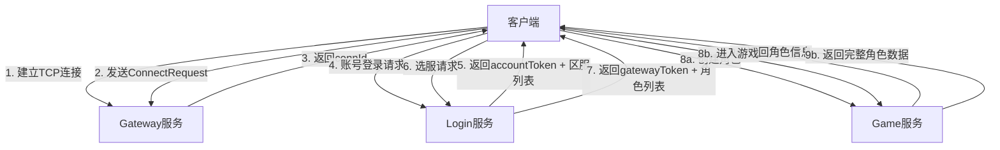
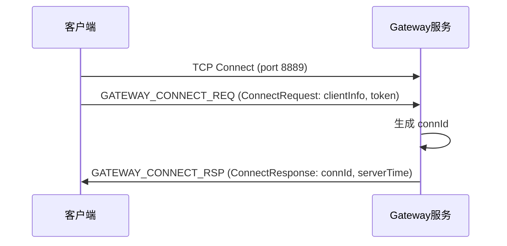
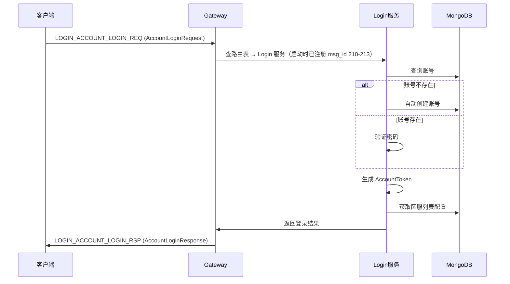
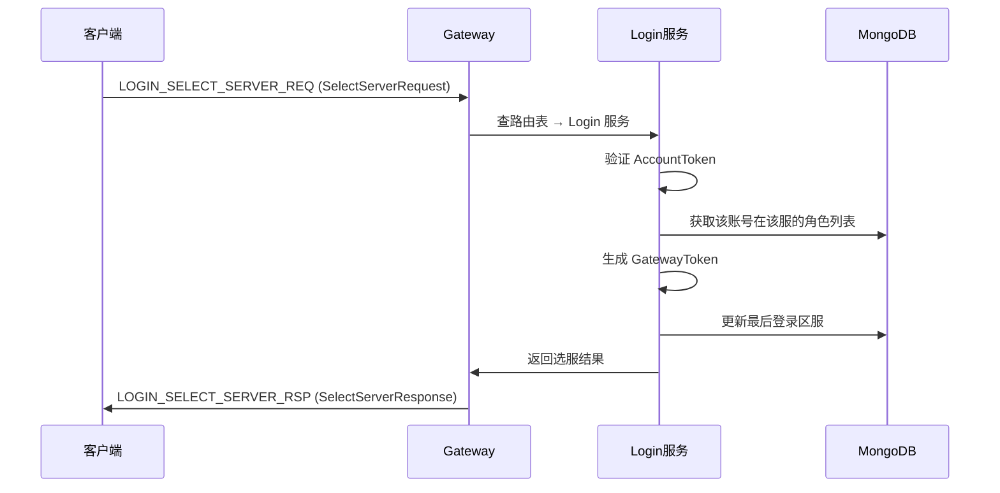
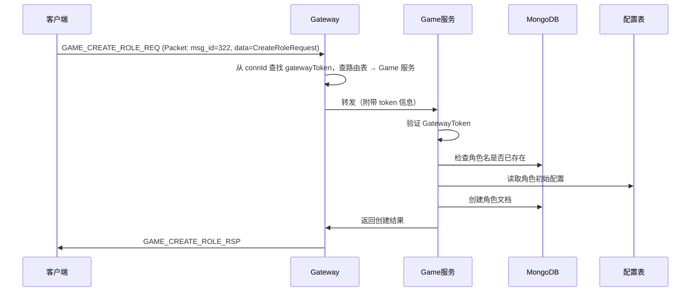
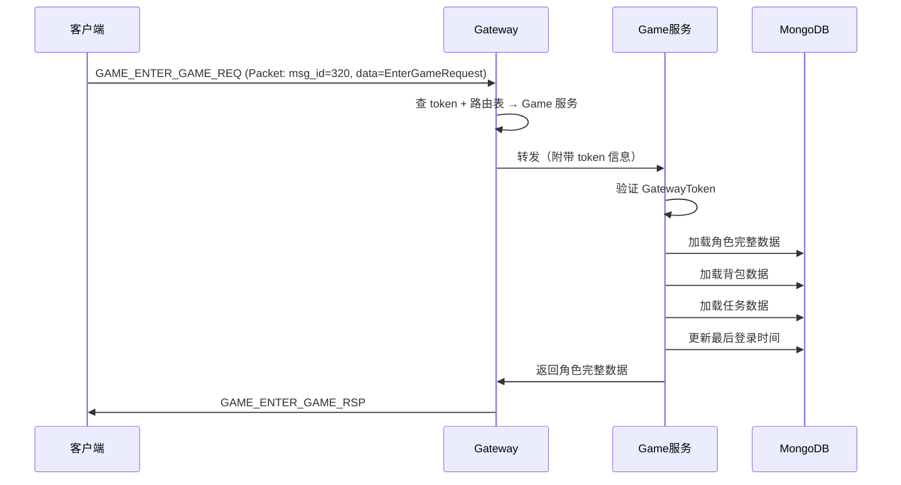
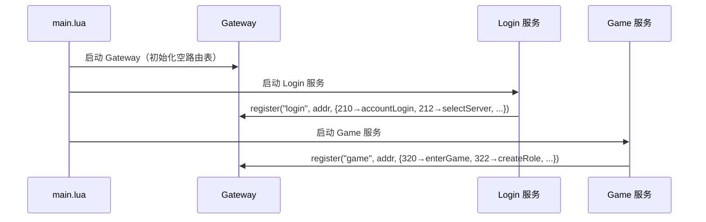
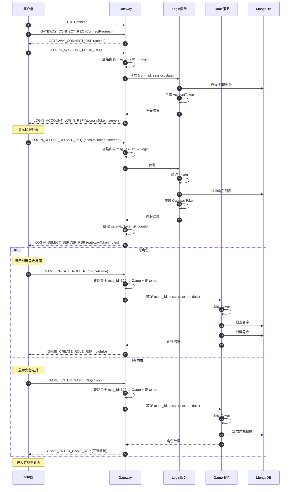
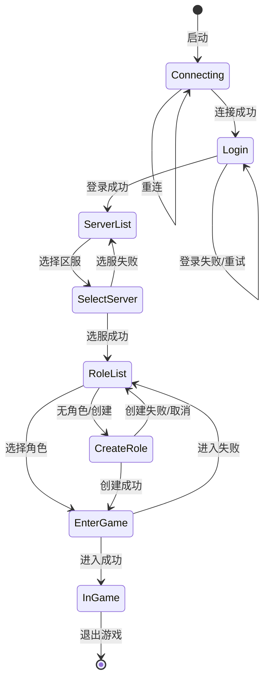

# 登录流程协议文档

本文档描述游戏客户端从连接到进入游戏的完整登录流程，包括协议定义、消息交互时序和数据格式。

## 一、整体流程概览



## 二、详细流程

### Phase 1: 建立连接

**时序图:**



**协议:**
- 消息ID: `GATEWAY_CONNECT_REQ (102)` / `GATEWAY_CONNECT_RSP (103)`
- 客户端 TCP 连接成功后，主动发送 `ConnectRequest`（包含客户端信息）
- Gateway 分配唯一 `connId` 标识该连接，返回 `ConnectResponse`
- 详见 `gateway.proto` 中的 `ConnectRequest` / `ConnectResponse`

---

### Phase 2: 账号登录

**时序图:**



**请求协议:**
```protobuf
// MsgId: LOGIN_ACCOUNT_LOGIN_REQ = 210
message AccountLoginRequest {
  string username = 1;          // 用户名
  string password = 2;          // 密码（MD5 哈希）
  string platform = 3;          // 平台：ios/android/pc
  string device_id = 4;         // 设备ID
  string client_version = 5;    // 客户端版本
}
```

**响应协议:**
```protobuf
// MsgId: LOGIN_ACCOUNT_LOGIN_RSP = 211
message AccountLoginResponse {
  ErrorCode code = 1;
  string message = 2;
  string account_token = 3;         // 账号级Token（全区服通用，有效期5分钟）
  uint32 account_id = 4;            // 账号ID
  repeated ServerInfo servers = 5;  // 区服列表（来自 server.proto）
  uint32 last_server_id = 6;        // 最近登录的区服ID
  string last_role_name = 7;        // 最近登录的角色名
}
```

**Token说明:**
- `accountToken`: JWT格式，包含 `accountId` 和 `username`，有效期5分钟
- 用于后续的选服操作，全区服通用

---

### Phase 3: 选服

**时序图:**



**请求协议:**
```protobuf
// MsgId: LOGIN_SELECT_SERVER_REQ = 212
message SelectServerRequest {
  string account_token = 1;     // 账号Token（来自登录响应）
  uint32 server_id = 2;         // 选择的区服ID
}
```

**响应协议:**
```protobuf
// MsgId: LOGIN_SELECT_SERVER_RSP = 213
message SelectServerResponse {
  ErrorCode code = 1;
  string message = 2;
  string gateway_token = 3;         // 区服级Token（区服专用，有效期7天）
  repeated RoleBrief roles = 4;     // 该区服的角色列表
  uint32 max_role_count = 5;        // 最大角色数（来自配置表，默认3）
  uint32 server_time = 6;           // 服务器时间（校时用）
}
```

**Token说明:**
- `gatewayToken`: JWT格式，包含 `accountId` 和 `serverId`，有效期7天
- 用于后续的游戏服操作（创建角色、进入游戏等）

---

### Phase 4a: 创建角色（新账号）

**时序图:**



**请求协议:**
```protobuf
// MsgId: GAME_CREATE_ROLE_REQ = 322
message CreateRoleRequest {
  string role_name = 1;         // 角色名
}
```

> **Token 传递说明:** `CreateRoleRequest` 中不包含 token 字段。客户端登录选服后获得的 `gatewayToken` 由 Gateway 维护，与 `connId` 绑定。Gateway 转发消息到 Game 服务时，通过 Skynet 内部消息附带 token 信息，Game 服务据此验证身份。

**响应协议:**
```protobuf
// MsgId: GAME_CREATE_ROLE_RSP = 323
message CreateRoleResponse {
  ErrorCode code = 1;
  string message = 2;
  FullRoleInfo role_info = 3;           // 新创建的角色信息
  repeated ItemInfo items = 4;          // 初始道具
  repeated TaskInfo tasks = 5;          // 初始任务
  uint32 server_time = 6;               // 服务器时间
}
```

---

### Phase 4b: 进入游戏（已有角色）

**时序图:**



**请求协议:**
```protobuf
// MsgId: GAME_ENTER_GAME_REQ = 320
message EnterGameRequest {
  uint64 role_id = 1;           // 角色ID
}
```

> **Token 传递说明:** 与 Phase 4a 相同，`gatewayToken` 不在请求消息体内，由 Gateway 通过 connId 关联传递。

**响应协议:**
```protobuf
// MsgId: GAME_ENTER_GAME_RSP = 321
message EnterGameResponse {
  ErrorCode code = 1;
  string message = 2;
  FullRoleInfo role_info = 3;           // 完整角色信息
  repeated ItemInfo items = 4;          // 背包道具
  repeated TaskInfo tasks = 5;          // 任务列表
  uint32 server_time = 6;               // 服务器时间
}
```

---

## 三、Gateway 路由机制

采用**服务自注册**模式：业务服务启动时主动向 Gateway 注册自己处理的消息 ID，Gateway 动态构建路由表。详见 [服务注册与消息路由](./服务注册与消息路由.md)。

**启动时注册：**



**Gateway 内部路由表（动态生成）：**

```lua
local route_table = {
    [210] = { addr = 0x0a, cmd = "accountLogin" },
    [211] = { addr = 0x0a, cmd = "accountLogin" },
    [212] = { addr = 0x0a, cmd = "selectServer" },
    [213] = { addr = 0x0a, cmd = "selectServer" },
    [320] = { addr = 0x0b, cmd = "enterGame" },
    [321] = { addr = 0x0b, cmd = "enterGame" },
    [322] = { addr = 0x0b, cmd = "createRole" },
    [323] = { addr = 0x0b, cmd = "createRole" },
}
```

**消息包装格式:**

所有客户端消息使用 `common.Packet` 包装：

```protobuf
message Packet {
  uint32 msg_id = 1;        // 消息ID（用于路由）
  uint32 session = 2;       // 会话ID（用于请求响应匹配）
  bytes data = 3;           // 消息体（具体消息的 protobuf 序列化）
  uint64 timestamp = 4;     // 时间戳
}
```

**转发流程：**
1. 客户端发送 `Packet`，Gateway 解码 `msg_id`
2. 查路由表获取目标服务地址和命令名
3. 从 `connId` 查找对应的 `gatewayToken`（选服后绑定）
4. 通过 `skynet.call(addr, "lua", cmd, { conn_id, session, token, data })` 转发
5. 后端服务返回结果，Gateway 封装为响应 `Packet` 回传客户端

---

## 四、完整交互流程图



---

## 五、错误码说明

错误码定义在 `protocols/proto/common.proto` 中的 `ErrorCode` enum。

| 错误码 | 说明 | 常见场景 |
|--------|------|----------|
| `SUCCESS (0)` | 成功 | - |
| `INVALID_REQUEST (2)` | 无效请求 | 缺少必填字段 |
| `UNAUTHORIZED (3)` | 未授权 | Token过期或无效 |
| `NOT_FOUND (5)` | 未找到 | 角色不存在 |
| `TIMEOUT (6)` | 超时 | 请求超时 |
| `INTERNAL_ERROR (7)` | 内部错误 | 服务器异常 |
| `ACCOUNT_NOT_FOUND (100)` | 账号不存在 | 账号ID无效 |
| `PASSWORD_ERROR (101)` | 密码错误 | 密码不匹配 |
| `ACCOUNT_BANNED (102)` | 账号被封禁 | 账号状态异常 |
| `ROLE_NOT_FOUND (200)` | 角色不存在 | 角色ID无效 |
| `ROLE_NAME_EXISTS (201)` | 角色名已存在 | 创建角色时名字重复 |
| `ROLE_COUNT_LIMIT (202)` | 角色数达上限 | 超过最大角色数 |
| `INVALID_ROLE_NAME (203)` | 角色名不合法 | 格式错误 |
| `SERVER_NOT_FOUND (300)` | 区服不存在 | 区服ID无效 |
| `SERVER_MAINTENANCE (301)` | 区服维护中 | 区服状态维护 |

完整定义见 `protocols/proto/common.proto`。

---

## 六、Token 机制详解

### AccountToken（账号Token）

```
有效期: 5分钟
用途: 选服、获取区服列表
包含: { accountId, username, iat, exp }
```

### GatewayToken（区服Token）

```
有效期: 7天
用途: 创建角色、进入游戏、游戏内操作
包含: { accountId, serverId, iat, exp }
```

### Token 转换流程

```
AccountToken (登录获得)
       ↓
   选服验证
       ↓
GatewayToken (选服获得)
       ↓
   Gateway 绑定到 connId
       ↓
   后续请求自动携带
```

---

## 七、配置文件说明

### 区服配置 (tbserverconfig)

```lua
{
  id = 1,
  server_name = "测试服1",
  host = "127.0.0.1",
  port = 8889,
  status = "smooth",  -- maintenance/smooth/crowded/full
  is_new = true,
  is_recommend = true,
}
```

### 账号配置 (tbaccountconfig)

```lua
{
  max_role_count = 3,       -- 最大角色数
  role_name_min_len = 2,    -- 角色名最小长度
  role_name_max_len = 12,   -- 角色名最大长度
}
```

### 角色初始配置 (tbroleinitconfig)

```lua
{
  init_level = 1,
  init_gold = 10000,
  init_diamond = 100,
  init_items = { ... },
}
```

---

## 八、客户端状态机



---

## 九、相关文件

### 协议定义

| 文件路径 | 说明 |
|----------|------|
| `protocols/proto/common.proto` | 通用定义（Packet、ErrorCode、ServerStatus） |
| `protocols/proto/gateway.proto` | Gateway 协议（连接、心跳） |
| `protocols/proto/login.proto` | 登录协议（账号登录、选服） |
| `protocols/proto/server.proto` | 区服协议（区服列表、状态） |
| `protocols/proto/game.proto` | 游戏协议（角色、背包、任务） |
| `protocols/proto/message_id.proto` | 消息ID枚举 |

### 服务实现

| 文件路径 | 说明 |
|----------|------|
| `server/src/skynet/gateway/` | Gateway 服务（待实现） |
| `server/src/skynet/login/` | Login 服务（待实现） |
| `server/src/skynet/game/` | Game 服务（待实现） |
| `server/src/skynet/db/` | 数据库服务 |
| `server/src/skynet/player/` | 玩家服务 |
| `server/src/skynet/service.ts` | defineService 服务定义框架 |
| `server/src/skynet/platform.ts` | Skynet IPlatform 实现 |
| `server/src/skynet/types.ts` | IPlatform 接口、业务类型 |

### 配置与部署

| 文件路径 | 说明 |
|----------|------|
| `tables/datas/common/` | 账号配置表 |
| `tables/datas/` | 区服配置表 |
| `docker/config.lua` | Skynet 运行配置 |
| `docker/main.lua` | 服务启动引导 |
